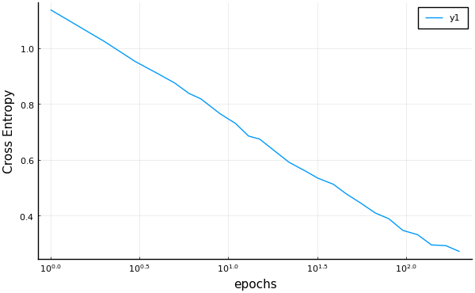

# MLJFlux

An interface to the Flux deep learning models for the
[MLJ](https://github.com/alan-turing-institute/MLJ.jl) machine
learning framework

| Branch   | Julia | CPU CI | GPU CI | Coverage |
| -------- | ----- | ------ | -----  | -------- |
| `master` | v1    | [![Continuous Integration (CPU)][gha-img-master]][gha-url] | [![Continuous Integration (GPU)][buildkite-julia1-img-master]][buildkite-url] | [![Code Coverage][coveralls-img-master]][coveralls-url] |
| `dev`    | v1    | [![Continuous Integration (CPU)][gha-img-dev]][gha-url] | [![Continuous Integration (GPU)][buildkite-julia1-img-dev]][buildkite-url] | [![Code Coverage][coveralls-img-dev]][coveralls-url] |

[gha-img-master]: https://github.com/FluxML/MLJFlux.jl/workflows/CI/badge.svg?branch=master "Continuous Integration (CPU)"
[gha-img-dev]: https://github.com/FluxML/MLJFlux.jl/workflows/CI/badge.svg?branch=dev "Continuous Integration (CPU)"
[gha-url]: https://github.com/FluxML/MLJFlux.jl/actions/workflows/ci.yml

[buildkite-julia1-img-master]: https://badge.buildkite.com/ae439e1f6ed6f178342a0ed166d0983de6ec1b72325e4e3e7e.svg?branch=master&step=Julia%20v1 "Continuous Integration (GPU)"
[buildkite-julia1-img-dev]: https://badge.buildkite.com/ae439e1f6ed6f178342a0ed166d0983de6ec1b72325e4e3e7e.svg?branch=dev&step=Julia%20v1 "Continuous Integration (GPU)"
[buildkite-url]: https://buildkite.com/julialang/mljflux-dot-jl

[coveralls-img-master]: https://coveralls.io/repos/github/alan-turing-institute/MLJFlux.jl/badge.svg?branch=master "Code Coverage"
[coveralls-img-dev]: https://coveralls.io/repos/github/alan-turing-institute/MLJFlux.jl/badge.svg?branch=dev "Code Coverage"
[coveralls-url]: https://github.com/FluxML/MLJFlux.jl/actions/workflows/ci.yml

MLJFlux makes it possible to apply the machine learning
meta-algorithms provided by MLJ - such as out-of-sample performance
evaluation and hyper-parameter optimization - to some classes of
**supervised deep learning models**. It does this by providing an
interface to the [Flux](https://fluxml.ai/Flux.jl/stable/)
framework.

The guiding vision of this package is to make evaluating and
optimizing basic Flux models more convenient to users already familiar
with the MLJ workflow. This goal will likely place restrictions of the
class of Flux models that can used, at least in the medium term. For
example, online learning, re-enforcement learning, and adversarial
networks are currently out of scope.

### Basic idea

Each MLJFlux model has a *builder* hyperparameter, an object encoding
instructions for creating a neural network given the data that the
model eventually sees (e.g., the number of classes in a classification
problem). While each MLJ model has a simple default builder, users
will generally need to define their own builders to get good results,
and this will require familiarity with the [Flux
API](https://fluxml.ai/Flux.jl/stable/) for defining a neural network
chain.

In the future MLJFlux may provide a larger assortment of canned
builders. Pull requests introducing new ones are most welcome.


### Installation

```julia
using Pkg
Pkg.activate("my_environment", shared=true)
Pkg.add("MLJ")
Pkg.add("MLJFlux")
Pkg.add("RDatasets")  # for the demo below
Pkg.add("Plots")
```

### Example

Following is an introductory example using a default builder and no
standardization of input features ([notebook/script](/examples/iris)).

For an example implementing early stopping and snapshots, using MLJ's
[`IteratedModel`
wrapper](https://alan-turing-institute.github.io/MLJ.jl/dev/controlling_iterative_models/),
see the [MNIST dataset
example](https://github.com/FluxML/MLJFlux.jl/blob/dev/examples/mnist).


#### Loading some data and instantiating a model

```julia
using MLJ
import RDatasets
iris = RDatasets.dataset("datasets", "iris");
y, X = unpack(iris, ==(:Species), colname -> true, rng=123);
NeuralNetworkClassifier = @load NeuralNetworkClassifier

julia> clf = NeuralNetworkClassifier()
NeuralNetworkClassifier(
    builder = Short(
            n_hidden = 0,
            dropout = 0.5,
            σ = NNlib.σ),
    finaliser = NNlib.softmax,
    optimiser = ADAM(0.001, (0.9, 0.999), IdDict{Any,Any}()),
    loss = Flux.crossentropy,
    epochs = 10,
    batch_size = 1,
    lambda = 0.0,
    alpha = 0.0,
    optimiser_changes_trigger_retraining = false) @ 1…60
```

#### Incremental training

```julia
import Random.seed!; seed!(123)
mach = machine(clf, X, y)
fit!(mach)

julia> training_loss = cross_entropy(predict(mach, X), y) |> mean
0.9064070459118777

# Increasing learning rate and adding iterations:
clf.optimiser.eta = clf.optimiser.eta * 2
clf.epochs = clf.epochs + 5

julia> fit!(mach, verbosity=2)
[ Info: Updating Machine{NeuralNetworkClassifier{Short,…},…} @804.
[ Info: Loss is 0.8686
[ Info: Loss is 0.8228
[ Info: Loss is 0.7706
[ Info: Loss is 0.7565
[ Info: Loss is 0.7347
Machine{NeuralNetworkClassifier{Short,…},…} @804 trained 2 times; caches data
  args:
    1:  Source @985 ⏎ `Table{AbstractVector{Continuous}}`
    2:  Source @367 ⏎ `AbstractVector{Multiclass{3}}`

julia> training_loss = cross_entropy(predict(mach, X), y) |> mean
0.7347092796453824
```

#### Accessing the Flux chain (model)

```julia
julia> fitted_params(mach).chain
Chain(Chain(Dense(4, 3, σ), Flux.Dropout{Float64}(0.5, false), Dense(3, 3)), softmax)
```

####  Evolution of out-of-sample performance

```julia
r = range(clf, :epochs, lower=1, upper=200, scale=:log10)
curve = learning_curve(clf, X, y,
                       range=r,
                       resampling=Holdout(fraction_train=0.7),
                       measure=cross_entropy)
using Plots
plot(curve.parameter_values,
       curve.measurements,
       xlab=curve.parameter_name,
       xscale=curve.parameter_scale,
       ylab = "Cross Entropy")

```




### Models

In MLJ a *model* is a mutable struct storing hyperparameters for some
learning algorithm indicated by the model name, and that's all. In
particular, an MLJ model does not store learned parameters.

*Warning:* In Flux the term "model" has another meaning. However, as all
Flux "models" used in MLJFLux are `Flux.Chain` objects, we call them
*chains*, and restrict use of "model" to models in the MLJ sense.

MLJFlux provides four model types, for use with input features `X` and
targets `y` of the [scientific
type](https://alan-turing-institute.github.io/MLJScientificTypes.jl/dev/)
indicated in the table below. The parameters `n_in` and `n_out`
refer to information passed to the builder, as described under
[Defining a new builder](defining-a-new-builder) below.

model type | prediction type | `scitype(X) <: _` | `scitype(y) <: _`
-----------|-----------------|---------------|----------------------------
`NeuralNetworkRegressor` | `Deterministic` | `Table(Continuous)` with `n_in` columns | `AbstractVector{<:Continuous)` (`n_out = 1`)
`MultitargetNeuralNetworkRegressor` | `Deterministic` | `Table(Continuous)` with `n_in` columns | `<: Table(Continuous)` with `n_out` columns
`NeuralNetworkClassifier` | `Probabilistic` | `<:Table(Continuous)` with `n_in` columns | `AbstractVector{<:Finite}` with `n_out` classes
`ImageClassifier` | `Probabilistic` | `AbstractVector(<:Image{W,H})` with `n_in = (W, H)` | `AbstractVector{<:Finite}` with `n_out` classes

> Table 1. Input and output types for MLJFlux models

#### Non-tabular input

Any `AbstractMatrix{<:AbstractFloat}` object `Xmat` can be forced to
have scitype `Table(Continuous)` by replacing it with ` X =
MLJ.table(Xmat)`. Furthermore, this wrapping, and subsequent
unwrapping under the hood, will compile to a no-op. At present this
includes support for sparse matrix data, but the implementation has
not been optimized for sparse data at this time and so should be used
with caution.

Instructions for coercing common image formats into some
`AbstractVector{<:Image}` are
[here](https://alan-turing-institute.github.io/MLJScientificTypes.jl/dev/#Type-coercion-for-image-data-1).


### Warm restart

MLJ machines cache state enabling the "warm restart" of model
training, as demonstrated in the example above. In the case of MLJFlux
models, `fit!(mach)` will use a warm restart if:

- only `model.epochs` has changed since the last call; or

- only `model.epochs` or `model.optimiser` have changed since the last
  call and `model.optimiser_changes_trigger_retraining == false` (the
  default) (the "state" part of the optimiser is ignored in this
  comparison). This allows one to dynamically modify learning rates,
  for example.

Here `model=mach.model` is the associated MLJ model.

The warm restart feature makes it possible to apply early stopping
criteria, as defined in
[EarlyStopping.jl](https://github.com/ablaom/EarlyStopping.jl). For an
example, see [/examples/mnist/](/examples/mnist/). (Eventually, this
will be handled by an MLJ model wrapper for controlling arbitrary
iterative models.)


### Training on a GPU

When instantiating a model for training on a GPU, specify
`acceleration=CUDALibs()`, as in

```julia
using MLJ
ImageClassifier = @load ImageClassifier
model = ImageClassifier(epochs=10, acceleration=CUDALibs())
mach = machine(model, X, y) |> fit!
```

In this example, the data `X, y` is copied onto the GPU under the hood
on the call to `fit!` and cached for use in any warm restart (see
above). The Flux chain used in training is always copied back to the
CPU at then conclusion of `fit!`, and made available as
`fitted_params(mach)`.


### Built-in builders

MLJ provides two simple builders out of the box. In all cases weights
  are intitialized using `glorot_uniform(rng)` where `rng` is the RNG
  (or `MersenneTwister` seed) specified by the MLJFlux model.

- `MLJFlux.Linear(σ=...)` builds a fully connected two layer network
  with `n_in` inputs and `n_out` outputs, with activation function
  `σ`, defaulting to a `MLJFlux.relu`.

- `MLJFlux.Short(n_hidden=..., dropout=..., σ=...)` builds a
  full-connected three-layer network with `n_in` inputs and `n_out`
  outputs using `n_hidden` nodes in the hidden layer and the specified
  `dropout` (defaulting to 0.5). An activation function `σ` is applied
  between the hidden and final layers. If `n_hidden=0` (the default)
  then `n_hidden` is the geometric mean of the number of input and
  output nodes.

See Table 1 above to see how `n_in` and `n_out` relate to the data.


### Model hyperparameters.

All models share the following hyper-parameters:

1. `builder`: Default = `MLJFlux.Linear(σ=Flux.relu)` (regressors) or
   `MLJFlux.Short(n_hidden=0, dropout=0.5, σ=Flux.σ)` (classifiers)

2. `optimiser`: The optimiser to use for training. Default =
   `Flux.ADAM()`

3. `loss`: The loss function used for training. Default = `Flux.mse`
   (regressors) and `Flux.crossentropy` (classifiers)

4. `n_epochs`: Number of epochs to train for. Default = `10`

5. `batch_size`: The batch_size for the data. Default = 1

6. `lambda`: The regularization strength. Default = 0. Range = [0, ∞)

7. `alpha`: The L2/L1 mix of regularization. Default = 0. Range = [0, 1]

8. `rng`: The random number generator (RNG) passed to builders, for
   weight intitialization, for example. Can be any `AbstractRNG` or
   the seed (integer) for a `MersenneTwister` that is reset on every
   cold restart of model (machine) training. Default =
   `GLOBAL_RNG`.

9. `acceleration`: Use `CUDALibs()` for training on GPU; default is `CPU1()`.

10. `optimiser_changes_trigger_retraining`: True if fitting an
   associated machine should trigger retraining from scratch whenever
   the optimiser changes. Default = `false`

The classifiers have an additional hyperparameter `finaliser` (default
= `Flux.softmax`) which is the operation applied to the unnormalized
output of the final layer to obtain probabilities (outputs summing to
one). Default = `Flux.softmax`. It should return a vector of the same
length as its input.

<!-- 9. `embedding_choice`: The embedding to use for handling categorical features. Options = :onehot, :entity_embedding. Default = :onehot. -->

<!-- 10. `embedding_dimension`: Valid only when -->
<!--     `embedding_choice=:entity_embedding`. The dimension follows the -->
<!--     formula `min(embedding_dimension, levels)`, where levels is the -->
<!--     number of levels in the pool of the categorical feature. If the -->
<!--     value is <= 0, this means that the dimension will be equal to (the -->
<!--     number of unique values of the feature) / 2. Default = -1 -->


### Defining a new builder

Following is an example defining a new builder for creating a simple
fully-connected neural network with two hidden layers, with `n1` nodes
in the first hidden layer, and `n2` nodes in the second, for use in
any of the first three models in Table 1. The definition includes one
mutable struct and one method:

```julia
mutable struct MyBuilder <: MLJFlux.Builder
    n1 :: Int
    n2 :: Int
end

function MLJFlux.build(nn::MyBuilder, rng, n_in, n_out)
    init = Flux.glorot_uniform(rng)
    return Chain(Dense(n_in, nn.n1, init=init),
                 Dense(nn.n1, nn.n2, init=init),
                 Dense(nn.n2, n_out, init=init))
end
```

Note here that `n_in` and `n_out` depend on the size of the data (see
Table 1).

For a concrete image classification example, see
[examples/mnist](examples/mnist).

More generally, defining a new builder means defining a new struct
sub-typing `MLJFlux.Builder` and defining a new `MLJFlux.build` method
with one of these signatures:

```julia
MLJFlux.build(builder::MyBuilder, rng, n_in, n_out)
MLJFlux.build(builder::MyBuilder, rng, n_in, n_out, n_channels) # for use with `ImageClassifier`
```

This method must return a `Flux.Chain` instance, `chain`, subject to the
following conditions:

- `chain(x)` must make sense:

    - for any `x <: Vector{<:AbstractFloat}` of length `n_in` (for use
      with one of the first three model types); or

    - for any `x <: Array{<:Float32, 4}` of size `(W, H, n_channels,
      batch_size)`, where `(W, H) = n_in`, `n_channels` is 1 or 3, and
      `batch_size` is any integer (for use with `ImageClassifier`)

- The object returned by `chain(x)` must be an `AbstractFloat` vector
  of length `n_out`.


### Loss functions

Currently, the loss function specified by `loss=...` is applied
internally by Flux and needs to conform to the Flux API. You cannot,
for example, supply one of MLJ's probabilistic loss functions, such as
`MLJ.cross_entropy` to one of the classifier constructors, although
you *should* use MLJ loss functions in MLJ meta-algorithms.


<!-- Unless, you are familiar with this API, it is recommended you use one -->
<!-- of the [loss functions provided by -->
<!-- Flux](https://github.com/FluxML/Flux.jl/blob/v0.8.3/src/layers/stateless.jl) -->
<!-- or leave `loss` unspecified to invoke the default. For a binary -->
<!-- classification problem you might also consider -->
<!-- `Flux.binarycrossentropy`, while for a classification problem with -->
<!-- more than two classes (most image problems) consider -->
<!-- `Flux.logitbinarycrossentropy`, as these have better numerical -->
<!-- stability than vanilla `Flux.crossentropy`. -->

### An image classification example

An expanded version of this example, with early stopping and
snapshots, is available [here](/examples/mnist).

We define a builder that builds a chain with six alternating
convolution and max-pool layers, and a final dense layer, which we
apply to the MNIST image dataset.

First we define a generic builder (working for any image size, color
or gray):

```julia
using MLJ
using Flux
using MLDatasets

# helper function
function flatten(x::AbstractArray)
    return reshape(x, :, size(x)[end])
end

import MLJFlux
mutable struct MyConvBuilder
    filter_size::Int
    channels1::Int
    channels2::Int
    channels3::Int
end

function MLJFlux.build(b::MyConvBuilder, rng, n_in, n_out, n_channels)

    k, c1, c2, c3 = b.filter_size, b.channels1, b.channels2, b.channels3

    mod(k, 2) == 1 || error("`filter_size` must be odd. ")

    # padding to preserve image size on convolution:
    p = div(k - 1, 2)

    front = Chain(
               Conv((k, k), n_channels => c1, pad=(p, p), relu),
               MaxPool((2, 2)),
               Conv((k, k), c1 => c2, pad=(p, p), relu),
               MaxPool((2, 2)),
               Conv((k, k), c2 => c3, pad=(p, p), relu),
               MaxPool((2 ,2)),
               flatten)
    d = Flux.outputsize(front, (n_in..., n_channels, 1)) |> first
    return Chain(front, Dense(d, n_out))
end
```

Next, we load some of the MNIST data and check scientific types
conform to those is the table above:

```julia
N = 500
Xraw, yraw = MNIST.traindata();
Xraw = Xraw[:,:,1:N];
yraw = yraw[1:N];

julia> scitype(Xraw)
AbstractArray{Unknown, 3}

julia> scitype(yraw)
AbstractArray{Count,1}
```

Inputs should have element scitype `GrayImage`:

```julia
X = coerce(Xraw, GrayImage);
```

For classifiers, target must have element scitype `<: Finite`:

```julia
y = coerce(yraw, Multiclass);
```

Instantiating an image classifier model:

```julia
ImageClassifier = @load ImageClassifier
clf = ImageClassifier(builder=MyConvBuilder(3, 16, 32, 32),
                      epochs=10,
                      loss=Flux.crossentropy)
```

And evaluating the accuracy of the model on a 30% holdout set:

```julia
mach = machine(clf, X, y)

julia> evaluate!(mach,
                 resampling=Holdout(rng=123, fraction_train=0.7),
                 operation=predict_mode,
                 measure=misclassification_rate)
┌────────────────────────┬───────────────┬────────────┐
│ _.measure              │ _.measurement │ _.per_fold │
├────────────────────────┼───────────────┼────────────┤
│ misclassification_rate │ 0.0467        │ [0.0467]   │
└────────────────────────┴───────────────┴────────────┘
```


### Adding new models to MLJFlux (advanced)

This section is mainly for MLJFlux developers. It assumes familiarity
with the [MLJ model
API](https://alan-turing-institute.github.io/MLJ.jl/dev/adding_models_for_general_use/)

If one subtypes a new model type as either
`MLJFlux.MLJFluxProbabilistic` or `MLJFlux.MLJFluxDeterministic`, then
instead of defining new methods for `MLJModelInterface.fit` and
`MLJModelInterface.update` one can make use of fallbacks by
implementing the lower level methods `shape`, `build`, and
`fitresult`. See the [classifier source code](/src/classifier.jl) for
an example.

One still needs to implement a new `predict` method.
