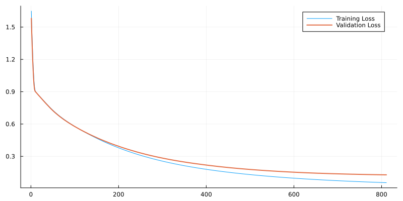

# MLJFlux

An interface to the Flux deep learning models for the
[MLJ](https://github.com/alan-turing-institute/MLJ.jl) machine
learning framework.

| Branch   | Julia | CPU CI | GPU CI | Coverage |
| -------- | ----- | ------ | -----  | -------- |
| `master` | v1    | [![Continuous Integration (CPU)][gha-img-master]][gha-url] | [![Continuous Integration (GPU)][buildkite-julia1-img-master]][buildkite-url] | [![Code Coverage][coveralls-img-master]][coveralls-url] |
| `dev`    | v1    | [![Continuous Integration (CPU)][gha-img-dev]][gha-url] | [![Continuous Integration (GPU)][buildkite-julia1-img-dev]][buildkite-url] | [![Code Coverage][coveralls-img-dev]][coveralls-url] |

[gha-img-master]: https://github.com/FluxML/MLJFlux.jl/workflows/CI/badge.svg?branch=master "Continuous Integration (CPU)"
[gha-img-dev]: https://github.com/FluxML/MLJFlux.jl/workflows/CI/badge.svg?branch=dev "Continuous Integration (CPU)"
[gha-url]: https://github.com/FluxML/MLJFlux.jl/actions/workflows/ci.yml

[buildkite-julia1-img-master]: https://badge.buildkite.com/ae439e1f6ed6f178342a0ed166d0983de6ec1b72325e4e3e7e.svg?branch=master&step=Julia%20v1 "Continuous Integration (GPU)"
[buildkite-julia1-img-dev]: https://badge.buildkite.com/ae439e1f6ed6f178342a0ed166d0983de6ec1b72325e4e3e7e.svg?branch=dev&step=Julia%20v1 "Continuous Integration (GPU)"
[buildkite-url]: https://buildkite.com/julialang/mljflux-dot-jl

[coveralls-img-master]: https://coveralls.io/repos/github/alan-turing-institute/MLJFlux.jl/badge.svg?branch=master "Code Coverage"
[coveralls-img-dev]: https://coveralls.io/repos/github/alan-turing-institute/MLJFlux.jl/badge.svg?branch=dev "Code Coverage"
[coveralls-url]: https://github.com/FluxML/MLJFlux.jl/actions/workflows/ci.yml

[](https://fluxml.github.io/MLJFlux.jl/dev/)


## Code Snippet

```julia
using MLJ, MLJFlux, RDatasets, Plots
```

Grab some data and split into features and target:

```julia
iris = RDatasets.dataset("datasets", "iris");
y, X = unpack(iris, ==(:Species), rng=123);
X = Float32.(X);      # To optmise for GPUs
```

Load model code and instantiate an MLJFlux model:

```julia
NeuralNetworkClassifier = @load NeuralNetworkClassifier pkg=MLJFlux

clf = NeuralNetworkClassifier(
    builder=MLJFlux.MLP(; hidden=(5,4)),
    batch_size=8,
    epochs=50,
    acceleration=CUDALibs()  # for training on a GPU
)
```

Wrap in "iteration controls":

```julia
stop_conditions = [
    Step(1),            # Apply controls every epoch
    NumberLimit(1000),  # Don't train for more than 1000 steps
    Patience(4),        # Stop after 4 iterations of deteriation in validation loss
    NumberSinceBest(5), # Or if the best loss occurred 5 iterations ago
    TimeLimit(30/60),   # Or if 30 minutes has passed
]

validation_losses = []
train_losses = []
callbacks = [
    WithLossDo(loss->push!(validation_losses, loss)),
    WithTrainingLossesDo(losses->push!(train_losses, losses[end])),
]

iterated_model = IteratedModel(
    model=clf,
    resampling=Holdout(fraction_train=0.5); # loss and stopping are based on out-of-sample
    measures=log_loss,
    controls=vcat(stop_conditions, callbacks),
);
```

Train the wrapped model:

```julia-repl
julia> mach = machine(iterated_model, X, y)
julia> fit!(mach)

[ Info: No iteration parameter specified. Using `iteration_parameter=:(epochs)`. 
[ Info: final loss: 0.1284184007796247
[ Info: final training loss: 0.055630706
[ Info: Stop triggered by NumberSinceBest(5) stopping criterion. 
[ Info: Total of 811 iterations. 
```
Inspect results:

```julia-repl
julia> plot(train_losses, label="Training Loss")
julia> plot!(validation_losses, label="Validation Loss", linewidth=2, size=(800,400))
```


