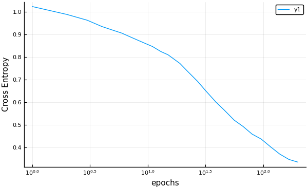

# MLJFlux

An interface to the Flux deep learning models for the
[MLJ](https://github.com/alan-turing-institute/MLJ.jl) machine
learning framework

[](https://travis-ci.com/alan-turing-institute/MLJFlux.jl) [](https://coveralls.io/github/alan-turing-institute/MLJFlux.jl?branch=master)

MLJFlux makes it possible to apply the machine learning
meta-algorithms provided by MLJ - such as out-of-sample performance
evaluation and hyper-parameter optimization - to some classes of
supervised deep learning models. It does this by providing an
interface to the [Flux](https://fluxml.ai/Flux.jl/stable/)
framework.


### Basic idea

Each MLJFlux model has a *builder* hyperparameter, an object encoding
instructions for creating a neural network given the data that the
model eventually sees (e.g., the number of classes in a classification
problem). While each MLJ model has a simple default builder, users
will generally need to define their own builders to get good results,
and this will require familiarity with the [Flux
API](https://fluxml.ai/Flux.jl/stable/) for defining a neural network
chain.

In the future MLJFlux may provided an assortment of more sophisticated
canned builders.

### Installation

```julia
using Pkg
Pkg.activate("my_environment", shared=true)
Pkg.add("MLJFlux")
Pkg.add("MLJ")
Pkg.add("RDatasets")  # for the demo below
```

### Example

Following is an introductory example using a default builder and no
standardization of input features.


#### Loading some data and instantiating a model

```julia
using MLJ
import RDatasets
iris = RDatasets.dataset("datasets", "iris");
y, X = unpack(iris, ==(:Species), colname -> true, rng=123);
@load NeuralNetworkClassifier

julia> clf = NeuralNetworkClassifier()
NeuralNetworkClassifier(
    builder = Short(
            n_hidden = 0,
            dropout = 0.5,
            σ = NNlib.σ),
    finaliser = NNlib.softmax,
    optimiser = ADAM(0.001, (0.9, 0.999), IdDict{Any,Any}()),
    loss = Flux.crossentropy,
    epochs = 10,
    batch_size = 1,
    lambda = 0.0,
    alpha = 0.0,
    optimiser_changes_trigger_retraining = false) @ 1…60
```

#### Incremental training

```julia
import Random.seed!; seed!(123)
mach = machine(clf, X, y)
fit!(mach)

julia> training_loss = cross_entropy(predict(mach, X), y) |> mean
0.89526004f0

# increase learning rate and add iterations:
clf.optimiser.eta = clf.optimiser.eta * 2
clf.epochs = clf.epochs + 5

julia> fit!(mach, verbosity=2)
[ Info: Updating Machine{NeuralNetworkClassifier{Short,…}} @240.
[ Info: Loss is 0.853
[ Info: Loss is 0.8207
[ Info: Loss is 0.8072
[ Info: Loss is 0.752
[ Info: Loss is 0.7077
Machine{NeuralNetworkClassifier{Short,…}} @ 1…42

julia> training_loss = cross_entropy(predict(mach, X), y) |> mean
0.7076618f0
```

#### Accessing the Flux chain (model)

```julia
julia> fitted_params(mach).chain
Chain(Chain(Dense(4, 3, σ), Flux.Dropout{Float64}(0.5, false), Dense(3, 3)), softmax)
```

####  Evolution of out-of-sample performance

```julia
r = range(clf, :epochs, lower=1, upper=200, scale=:log10)
curve = learning_curve(clf, X, y,
                       range=r,
                       resampling=Holdout(fraction_train=0.7),
                       measure=cross_entropy)
using Plots
plot(curve.parameter_values,
       curve.measurements,
       xlab=curve.parameter_name,
       xscale=curve.parameter_scale,
       ylab = "Cross Entropy")

```




### Models

In MLJ a *model* is a mutable struct storing hyperparameters for some
learning algorithm indicated by the model name, and that's all. In
particular, an MLJ model does not store learned parameters.

*Warning:* In Flux the term "model" has another meaning. However, as all
Flux "models" used in MLJFLux are `Flux.Chain` objects, we call them
*chains*, and restrict use of "model" to models in the MLJ sense.

MLJFlux provides four model types, for use with input features `X` and
targets `y` of the [scientific
type](https://alan-turing-institute.github.io/MLJScientificTypes.jl/dev/)
indicated in the table below. The parameters `n_in` and `n_out`
refer to information passed to the builder, as described under
[Defining a new builder](defining-a-new-builder) below.

model type | prediction type | `scitype(X) <: _` | `scitype(y) <: _`
-----------|-----------------|---------------|----------------------------
`NeuralNetworkRegressor` | `Deterministic` | `Table(Continuous)` with `n_in` columns | `AbstractVector{<:Continuous)` (`n_out = 1`)
`MultitargetNeuralNetworkRegressor` | `Deterministic` | `Table(Continuous)` with `n_in` columns | `<: Table(Continuous)` with `n_out` columns
`NeuralNetworkClassifier` | `Probabilistic` | `<:Table(Continuous)` with `n_in` columns | `AbstractVector{<:Finite}` with `n_out` classes
`ImageClassifier` | `Probabilistic` | `AbstractVector(<:Image{W,H})` with `n_in = (W, H)` | `AbstractVector{<:Finite}` with `n_out` classes

> Table 1. Input and output types for MLJFlux models

#### Non-tabular input

Any `AbstractMatrix{<:AbstractFloat}` object `Xmat` can be forced to
have scitype `Table(Continuous)` by replacing it with ` X =
MLJ.table(Xmat)`. Furthermore, this wrapping, and subsequent
unwrapping under the hood, will compile to a no-op. At present this
includes support for sparse matrix data, but the implementation has
not been optimized for sparse data at this time and so should be used
with caution.

Instructions for coercing common image formats into some
`AbstractVector{<:Image}` are
[here](https://alan-turing-institute.github.io/MLJScientificTypes.jl/dev/#Type-coercion-for-image-data-1).


#### Built-in builders

MLJ provides two simple builders out of the box:

- `MLJFlux.Linear(σ=...)` builds a fully connected two layer
  network with `n_in` inputs and `n_out` outputs, with activation
  function `σ`, defaulting to a `MLJFlux.relu`.

- `MLJFlux.Short(n_hidden=..., dropout=..., σ=...)` builds a
  full-connected three-layer network with `n_in` inputs and `n_out`
  outputs using `n_hidden` nodes in the hidden layer and the specified
  `dropout` (defaulting to 0.5). An activation function `σ` is applied
  between the hidden and final layers. If `n_hidden=0` (the default)
  then `n_hidden` is the geometric mean of the number of input and
  output nodes.

See Table 1 above to see how `n_in` and `n_out` relate to the data.


### Model hyperparameters.

All models share the following hyper-parameters:

1. `builder`: Default = `MLJFlux.Linear(σ=Flux.relu)` (regressors) or
   `MLJFlux.Short(n_hidden=0, dropout=0.5, σ=Flux.σ)` (classifiers)

2. `optimiser`: The optimiser to use for training. Default =
   `Flux.ADAM()`

3. `loss`: The loss function used for training. Default = `Flux.mse` (regressors) and `Flux.crossentropy` (classifiers)

4. `n_epochs`: Number of epochs to train for. Default = `10`

5. `batch_size`: The batch_size for the data. Default = 1

6. `lambda`: The regularization strength. Default = 0. Range = [0, ∞)

7. `alpha`: The L2/L1 mix of regularization. Default = 0. Range = [0, 1]

8. `optimiser_changes_trigger_retraining`: True if fitting an
   associated machine should trigger retraining from scratch whenever
   the optimiser changes. Default = `false`

The classifiers have an additional hyperparameter `finaliser` (default
= `Flux.softmax`) which is the operation applied to the unnormalized
output of the final layer to obtain probabilities (outputs summing to
one). Default = `Flux.softmax`. It should return a vector of the same
length as its input.

<!-- 9. `embedding_choice`: The embedding to use for handling categorical features. Options = :onehot, :entity_embedding. Default = :onehot. -->

<!-- 10. `embedding_dimension`: Valid only when -->
<!--     `embedding_choice=:entity_embedding`. The dimension follows the -->
<!--     formula `min(embedding_dimension, levels)`, where levels is the -->
<!--     number of levels in the pool of the categorical feature. If the -->
<!--     value is <= 0, this means that the dimension will be equal to (the -->
<!--     number of unique values of the feature) / 2. Default = -1 -->


### Defining a new builder

Following is an example defining a new builder for creating a simple
fully-connected neural network with two hidden layers, with `n1` nodes
in the first hidden layer, and `n2` nodes in the second, for use in
any of the first three models in Table 1. The definition includes one
mutable struct and one method:

```julia
mutable struct MyNetwork <: MLJFlux.Builder
    n1 :: Int
    n2 :: Int
end

function MLJFlux.build(nn::MyNetwork, n_in, n_out)
    return Chain(Dense(n_in, nn.n1), Dense(nn.n1, nn.n2), Dense(nn.n2, n_out))
end
```

Note here that `n_in` and `n_out` depend on the size of the data (see 
Table 1).

More generally, defining a new builder means defining a new struct
sub-typing `MLJFlux.Builder` and defining a new `MLJFlux.build` method
with one of these signatures:

```julia
MLJFlux.build(builder::MyNetwork, n_in, n_out)
MLJFlux.build(builder::MyNetwork, n_in, n_out, n_channels) # for use with `ImageClassifier`
```

This method must return a `Flux.Chain` instance, `chain`, subject to the
following conditions:

- `chain(x)` must make sense:

    - for any `x <: Vector{<:AbstractFloat}` of length `n_in` (for use
      with one of the first three model types); or

    - for any `x <: Array{<:Float32, 3}` of size
      `(W, H, n_channels)`, where `n_in = (W, H)` and `n_channels` is
      1 or 3 (for use with `ImageClassifier`)

- The object returned by `chain(x)` must be an `AbstractFloat` vector
  of length `n_out`.

For an builder example for use with `ImageClassifier` see
[below](an-image-classification-example).


### Loss functions

Currently, the loss function specified by `loss=...` is applied
internally by Flux and needs to conform to the Flux API. You cannot,
for example, supply one of MLJ's probabilistic loss functions, such as
`MLJ.cross_entropy` to one of the classifiers constructors, although
you *should* use MLJ loss functions in MLJ meta-algorithms.


<!-- Unless, you are familiar with this API, it is recommended you use one -->
<!-- of the [loss functions provided by -->
<!-- Flux](https://github.com/FluxML/Flux.jl/blob/v0.8.3/src/layers/stateless.jl) -->
<!-- or leave `loss` unspecified to invoke the default. For a binary -->
<!-- classification problem you might also consider -->
<!-- `Flux.binarycrossentropy`, while for a classification problem with -->
<!-- more than two classes (most image problems) consider -->
<!-- `Flux.logitbinarycrossentropy`, as these have better numerical -->
<!-- stability than vanilla `Flux.crossentropy`. -->

### An image classification example

We define a builder that builds a chain with six alternating
convolution and max-pool layers, and a final dense layer, which we
apply to the MNIST image dataset. 

First we define a generic builder (working for any image size, color
or gray):

```julia
using MLJ
using Flux

# helper function
function flatten(x::AbstractArray)
    return reshape(x, :, size(x)[end])
end

import MLJFlux
mutable struct MyConvBuilder <: MLJFlux.Builder
    filter_size::Int
    channels1::Int
    channels2::Int
    channels3::Int
end

function MLJFlux.build(b::MyConvBuilder, n_in, n_out, n_channels)

    k, c1, c2, c3 = b.filter_size, b.channels1, b.channels2, b.channels3

    mod(k, 2) == 1 || error("`filter_size` must be odd. ")

    # padding to preserve image size on convolution:
    p = div(k - 1, 2)

    # compute size, in first two dims, of output of final maxpool layer:
    half(x) = div(x, 2)
    h = n_in[1] |> half |> half |> half
    w = n_in[2] |> half |> half |> half

    return Chain(
        Conv((k, k), n_channels => c1, pad=(p, p), relu),
        MaxPool((2, 2)),
        Conv((k, k), c1 => c2, pad=(p, p), relu),
        MaxPool((2, 2)),
        Conv((k, k), c2 => c3, pad=(p, p), relu),
        MaxPool((2 ,2)),
        flatten,
        Dense(h*w*c3, n_out))
end
```

Next, we load some of the MNIST data and check scientific types
conform to those is the table above:

```
N = 1000
X, y = Flux.Data.MNIST.images()[1:N], Flux.Data.MNIST.labels()[1:N];

julia> scitype(X)
AbstractArray{GrayImage{28,28},1}

julia> scitype(y)
AbstractArray{Count,1}
```

For classifiers, target must have element scitype `<: Finite`, so we fix this:

```julia
y = coerce(y, Multiclass);
```

Instantiating an image classifier model:

```julia
@load ImageClassifier
clf = ImageClassifier(builder=MyConvBuilder(3, 16, 32, 32),
                      epochs=10,
                      loss=Flux.crossentropy)
```

And evaluating the accuracy of the model on a 30% holdout set:

```
mach = machine(clf, X, y)

julia> evaluate!(mach,
                 resampling=Holdout(rng=123, fraction_train=0.7),
                 operation=predict_mode,
                 measure=misclassification_rate)
┌────────────────────────┬───────────────┬────────────┐
│ _.measure              │ _.measurement │ _.per_fold │
├────────────────────────┼───────────────┼────────────┤
│ misclassification_rate │ 0.0467        │ [0.0467]   │
└────────────────────────┴───────────────┴────────────┘
```

